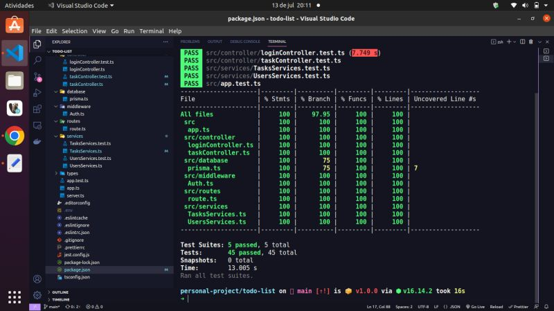

<h1 align="center">
Repositório com um projeto pessoal FullStack Todo-List.
</h1>

<h2 align="center">Back-End</h2>
  

## :rocket: Tecnologias

- 

  >

- 

  >

- 
  >
- 
  >
- 
  >
- 
  >
- 
  >
- 
  >
- 
  >
- 
  >
- 
  >
- 
  >

  <h3 align="center">Front-End</h3>
  

## :rocket: Tecnologias

- 
  >
- 
  >
- 
  >
- 
  >
- 
  >
- 
  >
- 
  >
- 
  >
- 
  >
- 
  >

  <h3 align="center">Mobile</h3>
  

## :rocket: Tecnologias

- 
  >
- 
  >
- 
  >
- 
  >
- 
  >
- 
  >
- 
  >
- 
  >
- 
  >
- 
  >

## Contato

 
  
   
 

